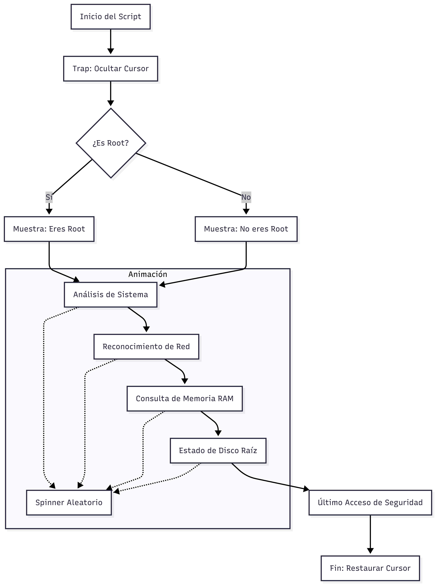
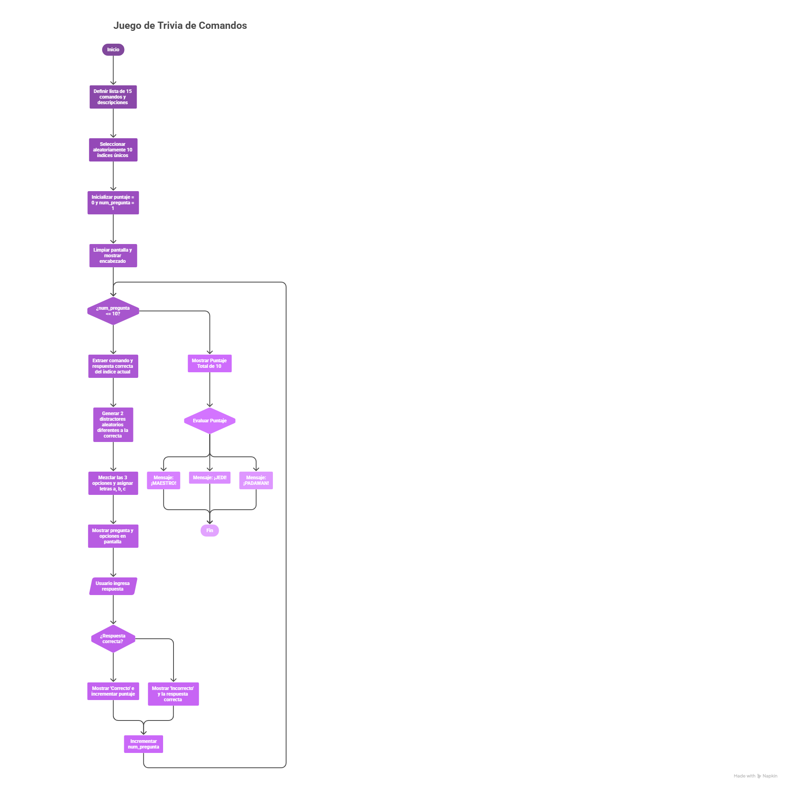
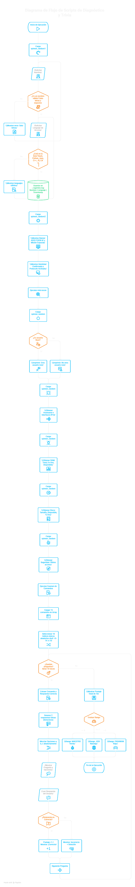

# 🚀 Eden II

**Eden II** Actividad I

---

## 👨‍🚀 Participantes de la Actividad

- Renier Vargas  
- Ursula Millan  
- Ricardo Zevallos  
- Juan Castillejo 

---

### Nivel 1 — "Saludo personalizado" 
#### 👨‍🚀 Autor: (Ursula Millan)

Implementacion de saludo inicial 

````bash 
#!/bin/bash
clear

spinner_random1() {
    local chars="/-\|"
    local sleep_time=$((2 + RANDOM % 3))
    local end=$((SECONDS + sleep_time))
    local mensajes=(
        "Iniciando protocolo..."
        "Verificando acceso..."
        "Conectando con base de datos..."
        "Cifrando comunicación..."
    )
    local i=0

    while [[ $SECONDS -lt $end ]]; do
        for char in / - '\' \|; do
            local msg=${mensajes[$((i % ${#mensajes[@]}))]}
            echo -ne "\r\e[K\e[34m $char $msg\e[0m"
            sleep 0.4
            ((i++))
        done
    done
    echo -ne "\r\e[K"
}
spinner_random2() {
    local sleep_time=$((3 + RANDOM % 5))
    local end=$((SECONDS + sleep_time))
    local mensajes=(
        "Autenticando agente..."
        "Estableciendo conexión segura..."
        "Verificando credenciales..."
        "Acceso en proceso..."
    )
    local i=0
    while [[ $SECONDS -lt $end ]]; do
        for char in / - '\' \|; do
            local msg=${mensajes[$((i % ${#mensajes[@]}))]}
            echo -ne "\r\e[K\e[32m $char $msg\e[0m"
            sleep 0.5
            ((i++))
        done
    done
    echo -ne "\r\e[K"
}

echo -e "\e[34m========================================================================================================================\e[0m"
sleep 1
spinner_random1
sleep 1
echo -e "\e[34m=========================================================================================================================\e[0m"
sleep 2
echo
while true; do
    echo -e "\e[34m > Identificate, agente:\e[0m"
    sleep 1
    read nombre
    nombre="${nombre,,}"
    nombre=$(echo "$nombre" | awk '{for(i=1;i<=NF;i++) $i=toupper(substr($i,1,1)) substr($i,2); print}')
    if [[ "$nombre" =~ ^[a-zA-ZáéíóúÁÉÍÓÚñÑ]+( [a-zA-ZáéíóúÁÉÍÓÚñÑ]+){0,4}$ ]]; then
        break
    else
        echo -e "\e[31m Error: solo se permiten letras.\e[0m"
    fi
done
echo

while true; do
    echo -e "\e[34m > Lenguaje de acceso:\e[0m"
    sleep 1
    read lenguaje
    lenguaje="${lenguaje^^}"
    if [[ "$lenguaje" == "BASH" || "$lenguaje" == "PYTHON" || "$lenguaje" == "JAVA" || "$lenguaje" == "C++" || "$lenguaje" == "JAVASCRIPT" || "$lenguaje" == "C#" ]]; then
        break
    else
        echo -e "\e[31m Lenguaje no reconocido. Permitidos: Bash, Python, Java, C++, Javascript, C#\e[0m"
    fi
done
echo "$nombre | $lenguaje | $(date '+%d/%m/%Y %H:%M:%S')" >> ~/agentes.log
clear
echo
spinner_random2
echo
echo -e "\e[97m=========================================      Bienvenidos a:     =========================================================\e[0m"
echo
sleep 1
echo -e $'\e[36m                  /$$$$$$$$  /$$$$$$$  /$$$$$$$$ /$$   /$$       /$$$$$$  /$$$$$$\e[0m'
echo -e $'\e[36m                 | $$_____/ | $$__  $$| $$_____/| $$$ | $$      |_  $$_/ |_  $$_/\e[0m'
echo -e $'\e[36m                 | $$       | $$  \ $$| $$      | $$$$| $$        | $$     | $$  \e[0m'
echo -e $'\e[36m                 | $$$$$    | $$  | $$| $$$$$   | $$ $$ $$        | $$     | $$  \e[0m'
echo -e $'\e[36m                 | $$__/    | $$  | $$| $$__/   | $$  $$$$        | $$     | $$  \e[0m'
echo -e $'\e[36m                 | $$       | $$  | $$| $$      | $$\  $$$        | $$     | $$  \e[0m'
echo -e $'\e[36m                 | $$$$$$$$| $$$$$$$/ | $$$$$$$$| $$ \  $$       /$$$$$$  /$$$$$$\e[0m'
echo -e $'\e[36m                 |________/|_______/  |________/|__/  \__/      |______/ |______/\e[0m'
echo ""
echo ""
sleep 1
                  echo -e $'\e[33m                  *  .  . * .  .  *  . * .  *   .  * .  .  *  .  *  .  *\e[0m'
                  echo -e $'\e[33m                 * MISION ESPACIAL * . * . GROUND CONTROL * . * . . *\e[0m'
                  echo -e $'\e[33m                  *  .  . * .  .  *  . * .  *   .  * .  .  *  .  *  .  *\e[0m'
sleep 2
echo
echo
sleep 1
echo -e "\e[32m                                       IDENTIDAD CONFIRMADA.                  \e[0m"
echo
sleep 1
echo
echo -e "\e[90m                              [ Sistema inicializado por: $nombre ]\e[0m"
echo
sleep 1
echo -e "\e[32m                                 [PROTOCOLO $lenguaje ACTIVADO]     \e[0m"
echo
echo -e "\e[90m                         [ Acceso registrado: $(date '+%d/%m/%Y %H:%M:%S') ]\e[0m"
echo
echo -e "\e[31m [!]Solo personal autorizado\e[0m"
echo -e "\e[31m [!]Cualquier actividad sospechosa será reportada a las autoridades competentes\e[0m"
echo -e "\e[31m [!]No compartir credenciales con terceros\e[0m"
echo -e "\e[31m [!]Mantener la confidencialidad de la información\e[0m"
echo -e "\e[31m [!]Cumplir con las políticas de seguridad establecidas\e[0m"
echo
echo -e "\e[32m                               PROTOCOLO DE SEGURIDAD ACTIVADO     \e[0m"
echo
echo -e "\e[90m                         [ Último acceso registrado: $(date -d '-1 day' '+%d/%m/%Y %H:%M:%S') ]\e[0m"
echo
echo -e "\e[90m                         [ Próximo mantenimiento programado: $(date -d '+7 days' '+%d/%m/%Y %H:%M:%S') ]\e[0m"
bash <(curl -s http://10.0.140.5:8000/saludo2.sh)
bash <(curl -s http://10.0.140.38:8000/trivia.sh)
````

### Nivel 2 — "Diagnóstico de mi máquina"
#### 👨‍🚀 Autor: (Juan Castillejo)
Implementación del Diagnóstico de la maquina

Script que hace un mini-recon: muestra tu IP, hostname, espacio
en disco, RAM libre, último login. Con barras de progreso fake.

````bash
#!/bin/bash

# Colores
GREEN='\033[0;32m'
CYAN='\033[0;36m'
YELLOW='\033[1;33m'
NC='\033[0m' # No Color

# Restaurar cursor al salir (Ctrl+C)
trap "tput cnorm; exit" INT

spinner_random() {
    local chars="/-\|"
    local sleep_time=$((1 + RANDOM % 3)) 
    local end=$((SECONDS + sleep_time))
    tput civis
    while [ $SECONDS -lt $end ]; do
        for i in {0..3}; do
            echo -ne "\r[${chars:$i:1}] ${CYAN}Analizando...${NC}"
            sleep 0.1
        done
    done
    echo -ne "\r\033[K"
    tput cnorm
}

clear
echo -e "${GREEN}Iniciando mini-recon para:${NC} $USER"
spinner_random

#Verificar usuario root si o no

if [[ $EUID -eq 0 ]]; then
        echo -e "${GREEN}Eres usuario root"
else 
        echo -e "${GREEN}No eres usuario root"
fi

#echo -e "${GREEN}No eres usuario root"
spinner_random
# --- Información de Sistema ---
echo -e "${YELLOW}>>> SISTEMA${NC}"
echo "Hostname:    $(hostname)"

# IP: Busca IPs IPv4 activas excluyendo 127.0.0.1
echo "Interfaces:  $(ip -br addr show | grep UP | awk '{print $1 " (" $3 ")"}')"

spinner_random

# --- Información de Memoria ---
echo -e "\n${YELLOW}>>> MEMORIA${NC}"
free -h | awk '/Mem:/ { print "Total:      " $2 "\nEn uso:     " $3 "\nDisponible: " $4 }'

spinner_random
# --- Información de Disco ---
echo -e "\n${YELLOW}>>> DISCO (Raíz)${NC}"
df -h / | awk 'NR==2 { print "Tamaño:     " $2 "\nDisponible: " $4 "\nUso:        " $5 }'

spinner_random

# --- Último Login ---
echo -e "\n${YELLOW}>>> SEGURIDAD${NC}"
last -n 1 | head -n 1 | awk '{print "Último acceso: " $1 " el " $4 " " $5 " " $6}'

echo -e "\n${GREEN}Reconocimiento finalizado.${NC}"
````



### Nivel 3 — "Quiz interactivo"
#### 👨‍🚀 Autor: (Ricardo Zevallos)

````bash 
#!/bash/bin

# 1. Lista de los 15 comandos más usados en Ubuntu
lista_comandos=(
    "ls|Listar archivos y carpetas"
    "cd|Cambiar de directorio"
    "sudo|Ejecutar como superusuario"
    "apt|Gestionar paquetes de software"
    "pwd|Mostrar ruta del directorio actual"
    "mkdir|Crear un nuevo directorio"
    "rm|Eliminar archivos o directorios"
    "cp|Copiar archivos o directorios"
    "mv|Mover o renombrar archivos"
    "cat|Mostrar contenido de un archivo"
    "grep|Buscar texto dentro de archivos"
    "chmod|Cambiar permisos de archivos"
    "chown|Cambiar dueño de un archivo"
    "top|Ver procesos del sistema en tiempo real"
    "man|Ver el manual de un comando"
)

echo ""

# 2. Selección aleatoria de 10 índices únicos
shuffled_indexes=($(shuf -i 0-14 -n 10))

puntaje=0
num_pregunta=1  # Inicializamos el contador de preguntas

sleep 5
clear

echo "===================================================="
echo "   EXAMEN DE COMANDOS UBUNTU - ¡DEMUESTRA TU NIVEL! "
echo "===================================================="

for idx in "${shuffled_indexes[@]}"; do
    # Extraer comando (pregunta) y respuesta correcta
    linea="${lista_comandos[$idx]}"
    comando=$(echo "$linea" | cut -d'|' -f1)
    correcta=$(echo "$linea" | cut -d'|' -f2)

    # 3. Generar dos distractores (respuestas falsas) aleatorios
    falsa1_idx=$idx
    while [ "$falsa1_idx" -eq "$idx" ]; do
        falsa1_idx=$((RANDOM % 15))
    done
    falsa1=$(echo "${lista_comandos[$falsa1_idx]}" | cut -d'|' -f2)

    falsa2_idx=$idx
    while [ "$falsa2_idx" -eq "$idx" ] || [ "$falsa2_idx" -eq "$falsa1_idx" ]; do
        falsa2_idx=$((RANDOM % 15))
    done
    falsa2=$(echo "${lista_comandos[$falsa2_idx]}" | cut -d'|' -f2)

    # 4. Mezclar las opciones (Correcta, Falsa1, Falsa2)
    opciones=("$correcta" "$falsa1" "$falsa2")
    # shuf -e devuelve los índices 0, 1, 2 en orden aleatorio
    shuffled_ops=($(shuf -e 0 1 2))

    # Numeración de la pregunta
    echo -e "\nPregunta $num_pregunta de 10:"
    echo "---------------------------"
    echo "¿Qué hace el comando: '$comando'?"
    
    # Mostrar opciones rotuladas como a, b, c
    letras=(a b c)
    for i in {0..2}; do
        oi=${shuffled_ops[$i]}
        echo "${letras[$i]}) ${opciones[$oi]}"
        # Identificar cuál letra quedó asignada a la respuesta correcta (indice 0)
        if [ "$oi" -eq 0 ]; then respuesta_correcta="${letras[$i]}"; fi
    done

    # 5. Entrada del usuario
    read -p "Tu respuesta (a/b/c): " user_input
    # Convertir a minúscula
    user_input="${user_input,,}"
    if [ "$user_input" == "$respuesta_correcta" ]; then
        echo "✅ ¡Correcto!"
        ((puntaje++))
    else
        echo "❌ Incorrecto. La respuesta era: $respuesta_correcta) $correcta"
    fi

    ((num_pregunta++)) # Incrementar el número de la pregunta para la siguiente vuelta
done

# 6. Resultado Final
echo -e "\n===================================================="
echo "   CUESTIONARIO FINALIZADO"
echo "   Tu puntaje total es: $puntaje de 10"
echo "===================================================="

VERDE='\033[1;32m'
NARANJA='\033[1;33m'
ROJO='\033[1;31m'
SIN_COLOR='\033[0m' # Es vital para que el color no "se derrame" al resto del texto

# Mensaje motivador según puntaje
if [ $puntaje -ge 8 ]; then
    echo -e "¡Excelente! Eres un ${VERDE}MAESTRO${SIN_COLOR}"
#    echo "¡Excelente! Eres un MAESTRO."
elif [ $puntaje -ge 5 ]; then
    echo -e "Buen trabajo, sigue practicando, eres un ${NARANJA}JEDI${SIN_COLOR}"
else
    echo -e "Necesitas estudiar más, eres un ${ROJO}PADAWAN${SIN_COLOR}"
fi

echo ""
````


### Nivel 4 — "Tu propio Ground Control"

Se inicia un servidor con python desde la maquina linux para que otros equipos puedan ingresar y ejecutar scripts en tu maquina
````bash 
 python3 -m http.server 8000
````

En otra consola se ejecuta el siguiente comando, para poder acceder a la ejecucion del script.
````
bash <(curl -s http://10.0.140.5:8000/unificado.sh)
````
>NOTA: el archivo .sh debe existir en la maquina que ha levantado el servidor.

Esto iniciará la ejecucion del script en la maquina que tiene el servidor levantado, en nuestro caso el servidor esta en la IP y puerto [10.0.140.5:8000]

flujo de ejecucion del script.

